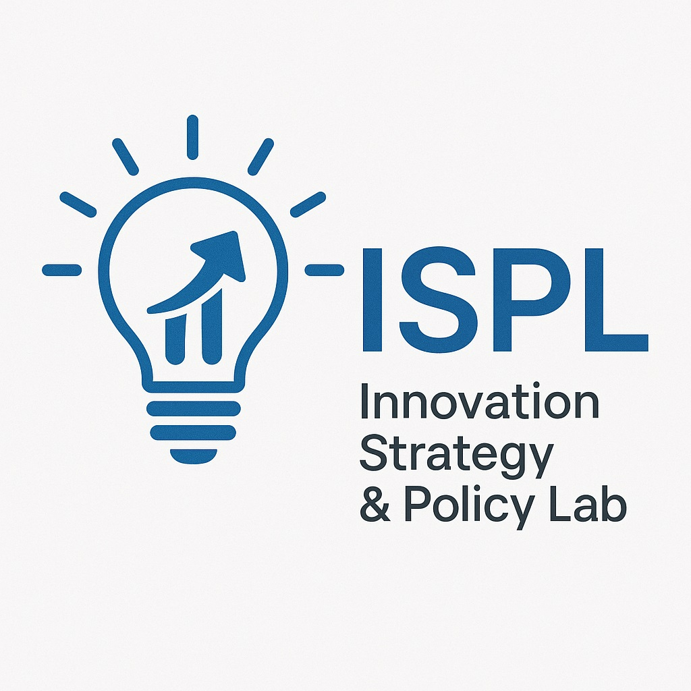

:::: profile-container
::: profile-image

:::

::: profile-content
## About Our Lab

The Innovation Strategy and Policy Lab (ISPL) at Konkuk University focuses on the intersection of technology, business strategy, and public policy. Our research applies quantitative methods to understand innovation processes, digital transformation, and the societal impact of emerging technologies.
:::
::::

## Research Areas

### Consumer Prefernce and New Product Design

-   Demand Forecasting
-   Consumer decision making process
-   R&D and marketing integration

### Innovation Policy

-   R&D roadmap
-   R&D incentive structures
-   Innovation System

### Digital Transformation

-   Business model innovation in the digital era
-   Digital platform strategies
-   Industry 4.0 implementation challenges

### Net Zero

-   Emission Trading System
-   Diffusion of Pro-Environmental Mobility
-   Design of retail electricity fare

## Lab Members

### Principal Investigator

-   **Prof. Dongnyok Shim**\
    Ph.D. in Management of Technology\
    Seoul National University

### Ph.D. Students

-   **김슬하**\
    Research topic: 탄소중립, 해운산업, 기술혁신

-   **김성윤**\
    Research topic: 시험인증산업, 산업정책, 국민안전

-   **최동환**\
    Research topic: 시험인증산업, 수요기반혁신정책

-   **권석민**\
    Research topic: 디지털전환, 정부혁신, AI거버넌스

-   **박은하**\
    Research topic: 코칭서비스 혁신, 디지털전환, 마케팅

-   **장은영**\
    Research topic: IT협업도구, 커뮤니케이션, 업무효율성, 생산성

### MS Students

-   **권다운**\
    Research topic: 기술혁신, 탄소중립, 에너지

-   **이건호**\
    Research topic: 모빌리티, 자율주행

### Alumni

#### Doctor

-   **방효민**
-   **김태균**

#### Master

-   **인혁준**

## Publications

Our lab has published over 30 peer-reviewed articles in journals such as Telematics and Informatics, Energy Economics, Energy & Environment. For a complete list, please visit our [Research page](research.qmd).

## Collaboration

We actively collaborate with: - Industry partners in technology and IT service sectors - Government agencies involved in innovation policy - International research networks focused on digital transformation - Other academic departments at Konkuk University

Please contact Prof. Shim (sk4me\@konkuk.ac.kr) with your CV and a brief statement of research interests.

